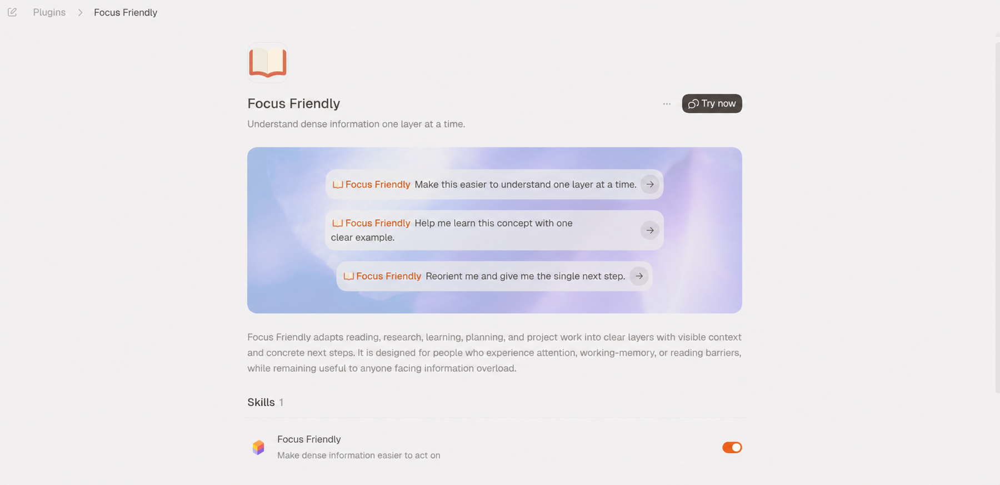

# Focus Friendly



Focus Friendly is a reusable [Agent Skill](https://agentskills.io/) that makes dense information and complex work easier to understand, navigate, and act on. The same skill is packaged as both a Codex plugin and a Claude Code plugin.

It is designed for people who experience ADHD, attention barriers, working-memory load, reading difficulty, or information overload. Anyone can use it.

## What it does

- Leads with the point and, when useful, one concrete next step.
- Reveals detail in layers instead of one large text wall.
- Turns long sources into a map and manageable chunks.
- Explains technical ideas with plain language and one concrete example.
- Learns presentation preferences from ordinary feedback without a setup questionnaire.
- Keeps verified project state, decisions, blockers, and next actions recoverable.
- Preserves caveats, citations, and exact technical details.
- Stays out of routine tasks that do not need focus adaptation.

It does not diagnose or treat ADHD.

## Install the skill

The canonical skill is at `plugins/focus-friendly/skills/focus-friendly/`. It uses only the portable `SKILL.md`, `references/`, and optional vendor metadata conventions, so other Agent Skills-compatible harnesses can install the same folder.

With the cross-harness Skills CLI:

```powershell
npx skills add https://github.com/yappologistic/focus-friendly/tree/main/plugins/focus-friendly/skills/focus-friendly
```

The CLI lets you choose a supported harness and project or user scope. For a non-interactive Claude Code user install:

```powershell
npx skills add https://github.com/yappologistic/focus-friendly/tree/main/plugins/focus-friendly/skills/focus-friendly --skill focus-friendly --agent claude-code --global --yes
```

You can also copy the canonical skill folder directly to the skill directory documented by your harness, such as `~/.claude/skills/focus-friendly/` for a personal Claude Code skill.

## Install as a Codex plugin

This repository includes a local marketplace at `.agents/plugins/marketplace.json`.

From the repository root:

```powershell
codex plugin marketplace add .
codex plugin add focus-friendly@personal
```

Then start a new Codex session and try:

```text
Use $focus-friendly to explain this documentation one layer at a time.
```

## Install as a Claude Code plugin

This repository is also a Claude Code marketplace. In Claude Code:

```text
/plugin marketplace add yappologistic/focus-friendly
/plugin install focus-friendly@focus-friendly
/reload-plugins
```

Invoke it explicitly with `/focus-friendly:focus-friendly`, or describe a matching task and let Claude load it automatically.

You can also say:

- “Give me the big picture first.”
- “One step at a time.”
- “I lost my place—where were we?”
- “Keep the details, but make this easier to scan.”

## Project map

- `plugins/focus-friendly/` — one dual-harness plugin package
- `plugins/focus-friendly/skills/focus-friendly/SKILL.md` — core behavior
- `plugins/focus-friendly/skills/focus-friendly/references/` — on-demand response, evidence, and recovery guidance
- `.agents/plugins/marketplace.json` — Codex marketplace
- `.claude-plugin/marketplace.json` — Claude Code marketplace
- `evals/cases.json` — positive, negative, and ambiguous behavior cases
- `scripts/validate_repo.py` — portable repository validation
- `.github/workflows/validate.yml` — continuous validation
- `docs/DESIGN.md` — design decisions and boundaries
- `docs/RESEARCH.md` — source-backed research notes
- `docs/TESTING.md` — validation and manual test cases

## Status

This is an early cross-harness release (`0.3.0`).

## Contributing

See [CONTRIBUTING.md](CONTRIBUTING.md). The project is licensed under the [MIT License](LICENSE).
